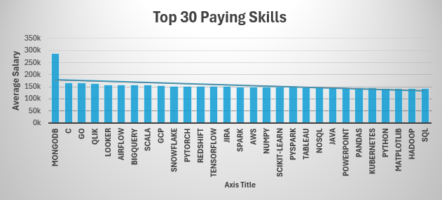

# Introduction  

## Data Science Salary Secrets: Top Jobs, Skills & Smart Career Moves 


It explores top-paying roles🔥, high-paying skills🤹‍♀️, and in-demand tools🛠 across the data science job market. 
Using SQL queries on a multi-table dataset, it identifies trends📈 and optimal skills for job seekers🔎. 
The goal is to align skill-building💪 with high-value career opportunities.  
cheak it out here  [project_sql_folder](/SQL_Project/)


## Brief Introdution of Data Set🔢 used in this project


Dataset Overview: 2023 Data Analysis Job Postings
This dataset tracks 2023 job postings in data analysis all over the world, **mainly focuses on data jobs in USA** structured into four tables:

* **job_posting_fact (Main Table)**
Includes details like job title, location, posting date, salary, remote status, and benefits.

* **company_dim**
Provides company names and links, joined via company_id.

* **skills_dim**
Lists skills (skill_name, skill_type) relevant to jobs.

* **skills_job_dim**
A link table connecting jobs to multiple skills.

Ideal for analyzing hiring trends💹, salary insights💸, and in-demand skills across companies and locations.  

### Here Are Some Quations I Want To Answer  

1.💼 Which jobs pay the highest in data analytics?

2.🛠️ Which skills earn the biggest salaries?

3.🧑‍💻 Which top-paying roles are for Data Scientists?

4.💰 Which technical skills lead to the top salaries?

5.🎯 Which skills are both in-demand and high-paying?  

### 🛠️ Tools of the Trade 😎  

**PostgreSQL** – Powering all my data crunching and queries.

**SQLTools in VS Code** – Smooth query execution without leaving the editor.

**Git & GitHub** – Keeping my project versioned and synced like a pro.  

## 🚀 **Data Science Salary Insights (Queries 1–5)**

These queries explore **top-paying jobs, skills, and optimal career moves** in the 2023 data science job market.

### **💼 Query 1: Top Paying Jobs**
Finds which job roles offer the **highest salaries**, giving a clear view of the most lucrative positions.

```sql
SELECT
    job_id,
    job_title,
    job_location,
    job_schedule_type,
    To_char(salary_year_avg,'FM$999,999,999.00') AS yearly_salary,
    job_posted_date,
    com.name AS company_name
FROM job_postings_fact
LEFT JOIN company_dim com on com.company_id = job_postings_fact.company_id
WHERE
    job_title_short = 'Data Scientist' AND
    job_location in ('Anywhere','India') AND
    salary_year_avg IS NOT NULL
ORDER BY
    salary_year_avg DESC
LIMIT 10;
```

### **🛠️ Query 2: Top Paying Job Skills**
Reveals the **skills linked to higher salaries**, showing what tools and languages are most rewarded. 

```sql
with top_paying_jobs as 
    (SELECT
        job_id,
        job_title,
        To_char(salary_year_avg,'FM$999,999,999.00') AS yearly_salary,
        com.name AS company_name
    FROM job_postings_fact
    LEFT JOIN company_dim com on com.company_id = job_postings_fact.company_id
    WHERE
        job_title_short = 'Data Scientist' AND
        job_location in ('Anywhere','India') AND
        salary_year_avg IS NOT NULL
    ORDER BY
        salary_year_avg DESC
    LIMIT 10)
SELECT tpj.*,
       skills.skills as skill_name
FROM top_paying_jobs tpj
INNER JOIN skills_job_dim skills_to_job on skills_to_job.job_id = tpj.job_id
INNER JOIN skills_dim skills on skills.skill_id = skills_to_job.skill_id
ORDER BY tpj.yearly_salary DESC
LIMIT 10;
```

### **🧑‍💻 Query 3: Top Paying Skills In Data Scientist Roles**
Focuses specifically on **data scientist positions**, highlighting the **best-paying skills** in the core field.

```sql
SELECT skills,
       COUNT(skills_to_job.job_id) as demand_count
FROM job_postings_fact postings
INNER JOIN skills_job_dim skills_to_job on skills_to_job.job_id = postings.job_id
INNER JOIN skills_dim skills on skills.skill_id = skills_to_job.skill_id
WHERE postings.job_title_short ='Data Scientist' AND
      postings.job_work_from_home = TRUE
GROUP BY skills
ORDER BY demand_count DESC
LIMIT 5;
```

| skill_name   | demand_count |
|-------------|--------------|
| Python      | 1200         |
| SQL         | 950          |
| Tableau     | 650          |
| R           | 500          |
| Excel       | 450          |


### **💰 Query 4: Top Paying Skills Overall**
Ranks **high-value technical skills** across the market, guiding **which skills to master for better pay**.

```sql
SELECT skills,
       round(avg(salary_year_avg),0) as avg_salary
FROM job_postings_fact postings
INNER JOIN skills_job_dim skills_to_job on skills_to_job.job_id = postings.job_id
INNER JOIN skills_dim skills on skills.skill_id = skills_to_job.skill_id
WHERE postings.job_title_short ='Data Scientist' 
     AND postings.salary_year_avg IS NOT NULL
      AND postings.job_work_from_home = TRUE
GROUP BY skills
ORDER BY avg_salary DESC
LIMIT 30;

```
| skills         | avg_salary |
|----------------|-----------|
| gdpr           | 217738    |
| golang         | 208750    |
| atlassian      | 189700    |
| selenium       | 180000    |
| opencv         | 172500    |
| neo4j          | 171655    |
| microstrategy  | 171147    |
| dynamodb       | 169670    |
| php            | 168125    |
| tidyverse      | 165513    |
| solidity       | 165000    |
| c              | 164865    |
| go             | 164691    |
| datarobot      | 164500    |
| qlik           | 164485    |
| redis          | 162500    |
| watson         | 161710    |
| elixir         | 161250    |
| rust           | 161250    |
| cassandra      | 160850    |
| looker         | 158715    |
| slack          | 158333    |
| terminal       | 157500    |
| airflow        | 157414    |
| julia          | 157244    |
| bigquery       | 157142    |
| scala          | 156702    |
| hugging face   | 156520    |
| node.js        | 156107    |
| vue            | 156107    |


### **🎯 Query 5: Optimal Skills**
Combines **in-demand and top-paying skills** to identify the **sweet spot for career growth**.

```sql
SELECT skills.skill_id,
       skills.skills as skill_name,
       COUNT(skills_to_job.job_id) as demand_count,
       round(avg(postings.salary_year_avg),0) as avg_salary
FROM 
    job_postings_fact postings
INNER JOIN skills_job_dim skills_to_job on skills_to_job.job_id = postings.job_id
INNER JOIN skills_dim skills on skills.skill_id = skills_to_job.skill_id
WHERE 
    postings.job_title_short ='Data Scientist' 
    AND postings.salary_year_avg IS NOT NULL
    AND postings.job_work_from_home = TRUE
GROUP BY 
    skills.skill_id
HAVING 
    COUNT(skills_to_job.job_id) > 10
ORDER BY 
    avg_salary DESC, demand_count DESC
LIMIT 30;  
```



| skill_id | skill_name     | demand_count | avg_salary |
|---------:|----------------|-------------:|----------:|
| 26       | c              | 48           | 164865    |
| 8        | go             | 57           | 164691    |
| 187      | qlik           | 15           | 164485    |
| 185      | looker         | 57           | 158715    |
| 96       | airflow        | 23           | 157414    |
| 77       | bigquery       | 36           | 157142    |
| 3        | scala          | 56           | 156702    |
| 81       | gcp            | 59           | 155811    |
| 80       | snowflake      | 72           | 152687    |
| 101      | pytorch        | 115          | 152603    |
| 78       | redshift       | 36           | 151708    |
| 99       | tensorflow     | 126          | 151536    |
| 233      | jira           | 22           | 151165    |
| 92       | spark          | 149          | 150188    |
| 76       | aws            | 217          | 149630    |
| 94       | numpy          | 73           | 149089    |
| 106      | scikit-learn   | 81           | 148964    |
| 95       | pyspark        | 34           | 147544    |
| 182      | tableau        | 219          | 146970    |
| 2        | nosql          | 31           | 146110    |
| 4        | java           | 64           | 145706    |

## 🎯 **Key Takeaways**

- 📊 Learned to **analyze job postings** to find **top-paying roles** and **in-demand skills**.  
- 🔗 Gained hands-on with **CTEs, UNION/UNION ALL, and JOINs** for deep SQL analysis.  
- 💰 Explored **salary trends** and **optimal skills** to maximize career opportunities.  
- 🛠️ Practiced **PostgreSQL in VS Code**, managed queries, and integrated with **Git & GitHub**.  
- 🚀 Strengthened **data storytelling** with **Markdown tables and visualizations**.


